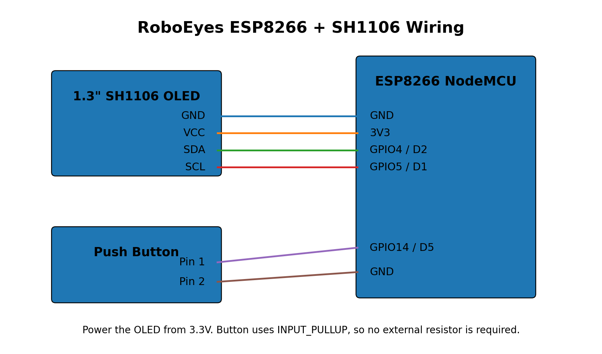

# RoboEyes ESP8266 + SH1106 Keychain Buddy

A ready-to-build ESP8266 version of the RoboEyes keychain / desk-buddy idea using a **1.3" 128×64 SH1106 I2C OLED** and the **FluxGarage RoboEyes** Arduino library.

The eyes blink automatically, look around on their own, and cycle through multiple expressions when the button is pressed.

## Features

- ESP8266 NodeMCU / ESP-12E compatible
- 1.3" SH1106 128×64 I2C OLED
- Smooth FluxGarage RoboEyes animations
- Automatic blinking
- Automatic idle eye movement
- 5 button-selectable modes:
  - Normal
  - Happy
  - Curious
  - Angry / Annoyed
  - Tired / Sad
- Uses raw GPIO numbers, so it does not depend on `D1`, `D2`, `D5` aliases
- No Wi-Fi or internet connection required

## Hardware

| Qty | Part |
|---:|---|
| 1 | ESP8266 NodeMCU / ESP-12E compatible board |
| 1 | 1.3" 128×64 SH1106 I2C OLED |
| 1 | Momentary push button |
| 4+ | Jumper wires |
| 1 | USB data cable |

## Wiring

### OLED → ESP8266

| SH1106 OLED | ESP8266 GPIO | NodeMCU label |
|---|---:|---|
| GND | GND | GND |
| VCC | 3.3V | 3V3 |
| SDA | GPIO4 | D2 |
| SCL | GPIO5 | D1 |

### Button → ESP8266

| Button | ESP8266 |
|---|---|
| Pin 1 | GPIO14 / D5 |
| Pin 2 | GND |

The sketch uses `INPUT_PULLUP`, so **no external resistor is required** for the button.



## Arduino IDE Setup

### 1. Install ESP8266 board support

In Arduino IDE, install the **ESP8266 by ESP8266 Community** board package using Boards Manager.

For a typical NodeMCU board select:

`Tools → Board → ESP8266 Boards → NodeMCU 1.0 (ESP-12E Module)`

Recommended first upload speed:

`115200`

### 2. Install libraries

Open:

`Sketch → Include Library → Manage Libraries`

Install:

- **Adafruit GFX Library**
- **Adafruit SH110X**
- **FluxGarage RoboEyes**

FluxGarage RoboEyes is the animation library used by this project.

Official RoboEyes repository:

https://github.com/FluxGarage/RoboEyes

### 3. Open the sketch

Open:

`RoboEyes_ESP8266_SH1106/RoboEyes_ESP8266_SH1106.ino`

### 4. Upload

1. Connect the ESP8266 with a USB **data** cable.
2. Select the correct board.
3. Select the correct COM port.
4. Click Upload.

## Controls

Each short button press changes the face:

`NORMAL → HAPPY → CURIOUS → ANGRY → TIRED → NORMAL`

When no button is pressed, RoboEyes continues its automatic blinking and idle eye movement.

## OLED Address

The sketch uses:

```cpp
#define OLED_ADDRESS 0x3C
```

Most SH1106 I2C modules use `0x3C`.

If the sketch uploads but the OLED remains blank, change it to:

```cpp
#define OLED_ADDRESS 0x3D
```

Then upload again.

## Pin Definitions Used by the Sketch

```cpp
#define OLED_SDA    4
#define OLED_SCL    5
#define BUTTON_PIN 14
```

These are the actual ESP8266 GPIO numbers:

- GPIO4 = NodeMCU D2
- GPIO5 = NodeMCU D1
- GPIO14 = NodeMCU D5

Using GPIO numbers avoids compilation errors such as:

`'D5' was not declared in this scope`

## Troubleshooting

### OLED is completely blank

Check:

1. VCC is connected to **3.3V**.
2. GND is connected correctly.
3. SDA is on GPIO4 / D2.
4. SCL is on GPIO5 / D1.
5. Try OLED address `0x3D`.
6. Make sure the display is actually **SH1106**, not a different controller.

### `D1`, `D2` or `D5` was not declared

This project already avoids those aliases and uses raw GPIO numbers. Make sure you are using the sketch included in this repository.

### `FluxGarage_RoboEyes.h: No such file or directory`

Install **FluxGarage RoboEyes** from Arduino Library Manager.

### `Adafruit_SH110X.h: No such file or directory`

Install **Adafruit SH110X** from Arduino Library Manager.

### Upload fails

Check:

- Correct ESP8266 board selected
- Correct COM port selected
- USB cable supports data
- Serial Monitor is closed
- Try another USB port
- Try upload speed 115200

### OLED works but button does not

The button must connect **GPIO14 / D5 directly to GND** when pressed.

No external resistor is needed because the code uses `INPUT_PULLUP`.

## Project Structure

```text
RoboEyes-ESP8266-SH1106/
├── RoboEyes_ESP8266_SH1106/
│   └── RoboEyes_ESP8266_SH1106.ino
├── docs/
│   ├── wiring-diagram.png
│   └── TROUBLESHOOTING.md
├── LICENSE
├── NOTICE.md
├── .gitignore
└── README.md
```

## Credits

This project uses the **FluxGarage RoboEyes** library by FluxGarage / Dennis Hoelscher.

Original library:
https://github.com/FluxGarage/RoboEyes

RoboEyes is licensed under the GNU General Public License v3.0.

This repository does **not** bundle a modified copy of the RoboEyes library. Install it separately through Arduino Library Manager.

## License

This project is released under the **GNU General Public License v3.0**. See `LICENSE`.
